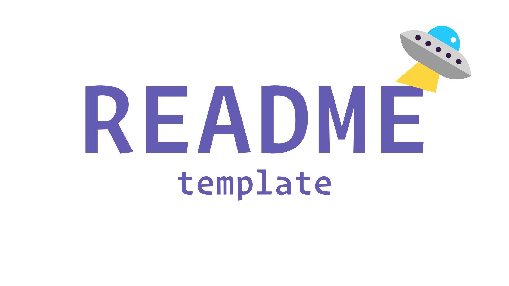

<div id="top"></div>

<!-- VARIABLES TO GLOBAL SEARCH + REPLACE
- snake                                      // repo_name
- Snake with Rust & WASM                     // project_title
- A starter template for a Rust CLI program  // project_description
- MylesWritesCode                            // github_username
- MylesCodesEmoji                            // twitter_handle
- myles-berueda                              // linkedin_username
- me@themapletree.io                         // email
-->

<!-- [![Forks][forks-shield]][forks-url] -->
<!-- [![Stargazers][stars-shield]][stars-url] -->
<!-- [![Issues][issues-shield]][issues-url] -->

<!-- PROJECT LOGO -->
<br />
<div align="center">
  <a href="https://github.com/MylesWritesCode/snake">
    
  </a>

<h3 align="center">Snake with Rust & WASM</h3>

  <p align="center">
    A starter template for a Rust CLI program
    <br />
    <a href="https://github.com/MylesWritesCode/snake"><strong>Explore the docs »</strong></a>
    <br />
    <br />
    <a href="https://github.com/MylesWritesCode/snake">View Demo</a>
    ·
    <a href="https://github.com/MylesWritesCode/snake/issues">Report Bug</a>
    ·
    <a href="https://github.com/MylesWritesCode/snake/issues">Request Feature</a>
  </p>
</div>

<!-- TABLE OF CONTENTS -->
<details>
  <summary>Table of Contents</summary>
  <ol>
    <li>
      <a href="#about-the-project">About The Project</a>
      <ul>
        <li><a href="#built-with">Built With</a></li>
      </ul>
    </li>
    <li>
      <a href="#getting-started">Getting Started</a>
      <ul>
        <li><a href="#prerequisites">Prerequisites</a></li>
        <li><a href="#installation">Installation</a></li>
      </ul>
    </li>
    <li><a href="#usage">Usage</a></li>
    <li><a href="#roadmap">Roadmap</a></li>
    <li><a href="#contributing">Contributing</a></li>
    <li><a href="#license">License</a></li>
    <li><a href="#contact">Contact</a></li>
    <li><a href="#acknowledgments">Acknowledgments</a></li>
  </ol>
</details>

<!-- ABOUT THE PROJECT -->

## About The Project

[![Product Name Screen Shot][product-screenshot]](https://example.com)

This is your basic Rust CLI starter kit. Most of the README isn't going to make
sense until I figure out exactly what and how I want the project to be built. In
the meantime, feel free to use this as-is.

<p align="right">(<a href="#top">back to top</a>)</p>

### Built With

- [Clap](https://github.com/clap-rs/clap)

<p align="right">(<a href="#top">back to top</a>)</p>

<!-- GETTING STARTED -->

## Getting Started

Install the pre-requisites linked below then follow the instrucations in usage.

### Prerequisites

- [Rust](https://rust-lang.org)
- [serve](https://www.npmjs.com/package/serve)
- [wasm-pack](https://rustwasm.github.io/wasm-pack/installer/)

<p align="right">(<a href="#top">back to top</a>)</p>

<!-- USAGE EXAMPLES -->

## Usage

1. Clone the repo

```
git clone https://github.com/MylesWritesCode/snake.git
```

2. Build the WASM from the Rust code

```
wasm-pack build --target web
```

3. Static serve the index file

```
serve
```

<p align="right">(<a href="#top">back to top</a>)</p>

<!-- CONTACT -->

## Contact

**Myles Berueda**

[![Twitter][twitter-shield]][twitter-url]

[![LinkedIn][linkedin-shield]][linkedin-url]

<p align="right">(<a href="#top">back to top</a>)</p>

<!-- ACKNOWLEDGMENTS -->

<!-- ## Acknowledgments -->

<!-- - []() -->
<!-- - []() -->
<!-- - []() -->

<!-- <p align="right">(<a href="#top">back to top</a>)</p> -->

<!-- MARKDOWN LINKS & IMAGES -->

[contributors-shield]: https://img.shields.io/github/contributors/MylesWritesCode/snake.svg?style=for-the-badge
[contributors-url]: https://github.com/MylesWritesCode/snake/graphs/contributors
[forks-shield]: https://img.shields.io/github/forks/MylesWritesCode/snake.svg?style=for-the-badge
[forks-url]: https://github.com/MylesWritesCode/snake/network/members
[stars-shield]: https://img.shields.io/github/stars/MylesWritesCode/snake.svg?style=for-the-badge
[stars-url]: https://github.com/MylesWritesCode/snake/stargazers
[issues-shield]: https://img.shields.io/github/issues/MylesWritesCode/snake.svg?style=for-the-badge
[issues-url]: https://github.com/MylesWritesCode/snake/issues
[license-shield]: https://img.shields.io/github/license/MylesWritesCode/snake.svg?style=for-the-badge
[license-url]: https://github.com/MylesWritesCode/snake/blob/master/LICENSE
[linkedin-shield]: https://img.shields.io/badge/-LinkedIn-black.svg?style=for-the-badge&logo=linkedin&colorB=555
[linkedin-url]: https://linkedin.com/in/myles-berueda
[twitter-shield]: https://img.shields.io/twitter/follow/MylesCodesEmoji?style=for-the-badge
[twitter-url]: https://twitter.com/MylesCodesEmoji
[product-screenshot]: .meta/screenshot.png
